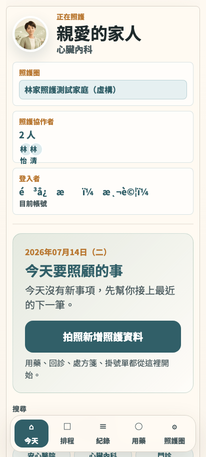
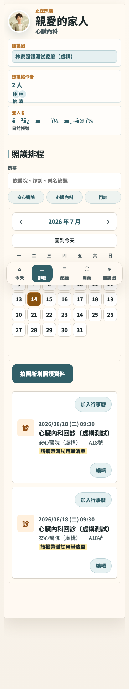
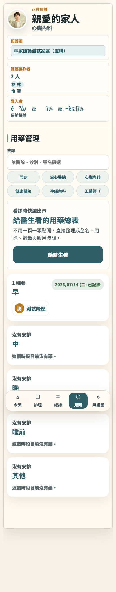
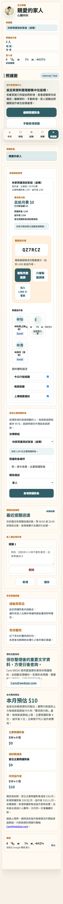
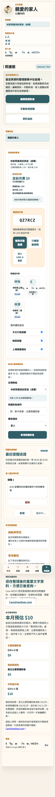

# 家屬協作者實測體驗審查｜Care WEDO staging

測試日期：2026-07-14  
角色：陳志明，48 歲，主要照護者的哥哥；平常用 Android，想協助管理父親林清河伯伯的就醫與用藥資訊  
裝置：Android 等效 viewport 412 × 915  
測試站：`https://care-wedo-staging.pages.dev`（僅虛構資料）

## 1. 一句話結論

核心協作已經成立：我能登入同一家庭、看到主要照護者新增的行程，也能替長輩記錄服藥；但家庭提醒儲存沒有完成回饋，加上姓名亂碼與身分／費用說明矛盾，現在仍不適合拿來承擔「不能漏掉」的重要照護事項。

## 2. 實際操作紀錄

### 親眼看到的事實

1. 以協作者帳號成功登入，畫面顯示「林家照護測試家庭（虛構）」、林清河（測試）、2 位照護協作者與目前登入者。
2. 「今天」頁顯示 2026/08/18 09:30 心臟內科回診；排程操作軌跡也看到主要照護者新增的 2026/08/20 行程，證明跨帳號資料可見。
3. 排程截圖中 2026/08/18 同一筆回診卡片重複出現兩次，各自都有「加入行事曆」與「編輯」。
4. 「用藥」頁顯示 1 種早上用藥「測試降壓」。按下「我已吃完」後，狀態改為「2026/07/14（二）已記錄」。
5. 「照護圈」可見協作者管理中心、家庭成員、邀請碼 `QZ7RCZ`、複製邀請文／邀請碼、通知設定、家庭提醒、費用與付款。
6. 在「家人要記得的事」輸入 8/20 家庭提醒並按儲存後，按鈕停在「儲存中...」；證據 JSON 顯示 `familyReminderVisible: false`，沒有成功訊息，內容也沒有重新回顯。因此結果只能判定為不明，不能宣稱儲存成功。
7. 中文登入者姓名在首頁、排程、用藥與照護圈均顯示 mojibake 亂碼；帳號區同時寫「目前以 Google 帳號登入」，成員卡則把測試帳號標成 Email。
8. 家庭卡顯示「主要照護對象 1/99、協作者 2/98、目前月費 $0」，下方費用預估卻寫每群組上限 4 位／5 位與本月預估 $10。
9. 412 px 登入頁的長 Email 會溢出輸入框，並與「密碼」標籤重疊。

### 推論／使用者判斷

- 看得到另一位家人新增的 8/20 行程，是最有價值的協作證據；我不用再靠 LINE 追問「有沒有登記」。
- 「我已吃完」成功後直接顯示日期，比只有 toast 更可靠；但若多人都能代長輩按，應清楚顯示是誰記錄的。
- 家庭提醒停在「儲存中...」最危險，因為使用者可能以為已交代完成，實際上其他家人未必看得到。
- 姓名亂碼與登入方式標示錯誤會傷害身分信任；照護資料中「我現在代表誰」不能模糊。

## 3. 最該強化的主要功能

「家庭事項的可靠同步狀態」最該強化。新增、修改或完成任何行程、藥單、家庭提醒後，都應顯示：是否已儲存、何時同步、由誰操作、失敗怎麼重試。家庭協作的價值不只是能輸入，而是每個人都能確定同一件事已經寫進共同紀錄。

## 4. 真正有用的部分

- 同家庭與照護對象在各頁固定出現，不容易誤入其他家庭。
- 主要照護者新增的 8/20 行程可被協作者看見，跨帳號同步確實有發生。
- 服藥完成操作短，成功後日期狀態直接留在卡片上。
- 底部「今天／排程／紀錄／用藥／照護圈」五個入口符合照護工作的心智模型。
- 邀請碼、完整邀請文與成員清單集中在照護圈，功能位置合理。

## 5. 痛點／不好用／卡住

- **P0**：家庭提醒儲存卡在「儲存中...」，沒有成功、失敗或重試；資料是否送達不明。
- **P0**：中文姓名全面亂碼，無法可靠辨識目前登入者與成員。
- **P1**：排程中同一筆 8/18 回診重複兩次，可能造成重複加入行事曆或重複編輯。
- **P1**：服藥狀態只顯示「已記錄」，沒有顯示由誰代為確認。
- **P1**：測試 Email/Password 登入後被標成 Google 帳號，成員卡又標 Email，身分來源互相矛盾。
- **P1**：家庭卡與本月預估的 99/98、4/5、$0/$10 同頁並存，協作者無法判斷真實上限與是否會扣款。
- **P1**：長 Email 在手機登入表單越界，與下一欄標籤重疊。
- **P2**：照護圈單頁很長，邀請、成員、通知、照護對象、提醒、資料、費用與帳號全部堆疊，重要任務不易快速回找。

## 6. 用不到／冗餘／可刪的功能區塊

- 同一頁同時呈現「費用與付款」與另一套「本月費用預估」，在規則未統一前應只保留一個可信的費用摘要。
- staging 的 Internal/Test、99/98 上限與正式 4/5 收費說明應由環境旗標擇一顯示，不要把兩套規則同時交給使用者解讀。
- 照護圈的說明性長文可收進「資料與隱私」摺疊區，第一屏優先保留成員、邀請、權限與家庭提醒。

## 7. 優化建議

- **P0**：家庭提醒儲存加入明確三態：儲存中、已儲存（時間／操作者）、儲存失敗（原因／重試）；逾時即解除 loading，保留輸入內容。先以顯示層與 timeout/重試處理，可回退。
- **P0**：修正姓名 UTF-8 解碼鏈路，並以三個繁中測試姓名做登入、成員卡與異動紀錄的部署 smoke test。
- **P0**：重要異動建立 audit trail：誰在何時新增／修改行程、確認服藥、修改藥單或家庭提醒；不可只留最終狀態。
- **P1**：排程依資料 ID 去重；重複資料先以 feature flag 在顯示層折疊並提示，不直接刪資料。
- **P1**：首次進入照護圈顯示角色摘要：「你是照護協作者，可編輯哪些資料、哪些操作會通知家人」。每個重要按鈕旁補權限與影響範圍。
- **P1**：登入方式依實際 provider 顯示；測試 Email/Password 不標成 Google。
- **P1**：費用規則只由單一 SSOT 計算與呈現，清楚分開「目前已涵蓋」「下期預估」「環境測試上限」。
- **P1**：登入 input 設 `min-width: 0; width: 100%`，label 與 input 各自成列，長 Email 不越界。
- **P2**：照護圈改成「成員與邀請／提醒與通知／資料與照護對象／費用與帳號」四個可收合區塊，保留目前單頁結構即可回退。

## 8. 手機／長輩友善檢核

- 主要按鈕與底部導覽夠大，選中分頁明顯。
- 卡片文字對比清楚；服藥完成後的綠色日期標籤容易確認。
- 排程頁底部導覽會浮在月曆與內容之上，長頁捲動時有遮擋風險。
- 照護圈過長，48 歲協作者尚可操作，但要回找家庭提醒或費用需大量捲動。
- 姓名亂碼不是美觀問題，而是辨識錯人的安全問題。

## 9. 視覺證據與未驗到項目

未驗證：重新登入後家庭提醒是否存在、其他帳號是否即時看到服藥紀錄、邀請碼實際接受流程、權限不足時的後端拒絕訊息、修改既有藥單欄位與異動復原。

## 完成回報

- **已完成**：協作者登入同家庭、跨帳號行程可見、服藥完成狀態操作、家庭提醒儲存嘗試、成員／邀請／通知／費用與權限文案檢視，以及 412 × 915 視覺證據分析。
- **未完成／未處理**：家庭提醒是否真正落庫與跨帳號可見、邀請接受閉環、既有藥單欄位編輯、異動復原；現有證據不足，未冒充已驗證。
- **自行追加**：辨識姓名亂碼、8/18 排程重複、登入 provider 標示錯誤、費用／人數上限矛盾及手機登入溢出。
- **驗證結果與證據**：服藥 JSON 為 `medicationRecorded: true` 且畫面顯示 7/14 已記錄；家庭提醒 JSON 為 `familyReminderVisible: false` 且按鈕停在「儲存中...」；各頁 PNG 與 inventory 如上。
- **剩餘風險**：提醒靜默失敗、多人異動無操作者紀錄、錯誤身分顯示及重複排程，可能讓家人誤判照護事項是否已完成。
